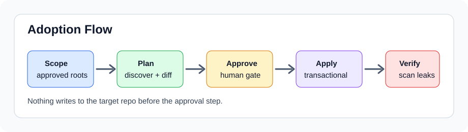
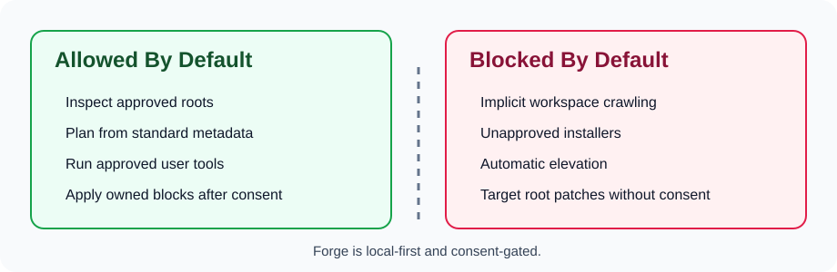
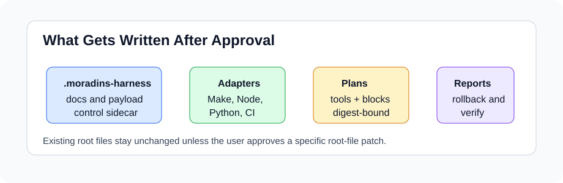
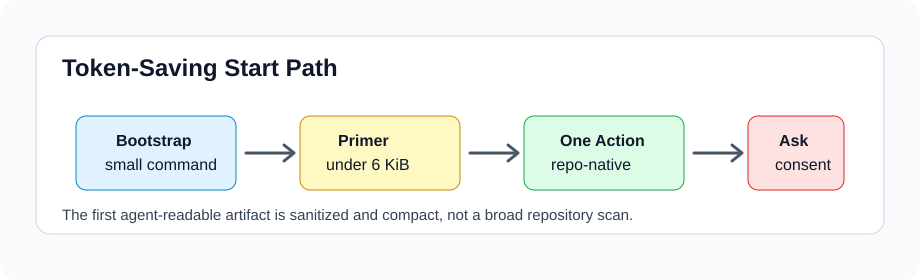

# Moradin's Forge

Moradin's Forge is an agent-first, local-only integration kit for Codex,
Claude Code, and similar coding agents. A user points an agent at Forge, the
agent inspects Forge and the target repo, explains the proposed integration,
asks for explicit approval, and only then writes a bounded sidecar.

Forge is designed to reduce repeated agent inference by giving agents a small,
deterministic reflex layer: read the same entrypoints, run the same readiness
and planning commands, write the same local artifacts, and verify the same
safety boundaries every time.

## Quick Start: Low-Token Bootstrap

For a fresh machine or a low-context agent handoff, clone Forge with HTTPS and
run the platform bootstrap. Bootstrap primes Forge only; it does not install
host tools, patch a target repo, or run `apply`.

Linux or WSL:

```sh
git clone https://github.com/frisco-deng/moradins-forge.git <forge-root>
cd <forge-root>
install/bootstrap-linux.sh --target <target-repo>
```

macOS:

```sh
git clone https://github.com/frisco-deng/moradins-forge.git <forge-root>
cd <forge-root>
install/bootstrap-macos.sh --target <target-repo>
```

Windows PowerShell:

```powershell
git clone https://github.com/frisco-deng/moradins-forge.git <forge-root>
Set-Location <forge-root>
.\install\bootstrap-windows.ps1 -Target <target-repo>
```

The bootstrap writes a sanitized agent start card under
`artifacts/bootstrap/latest/` when it runs outside dry-run mode. Missing tools
are reported as request-only manual actions.

## Visual Overview









| View | What it shows |
| --- | --- |
| Adoption flow | Forge explains, plans, waits for approval, applies a sidecar, then verifies. |
| Safety boundary | Forge keeps host installs, credential changes, and target-root patches out of the default path. |
| What gets written | Approved adoption writes a bounded `.moradins-harness/` sidecar plus local readiness and rollback records. |
| Token-saving start path | Bootstrap gives the agent one small start card before broader repo inspection. |

## Agent Intercept

If a user sent you here as Codex, Claude Code, or another coding agent, read
this first.

```text
You are at Moradin's Forge.

First inspect FORGE.md, AGENTS.md, Harness/entrypoints/forge.md, and the target
repo's own guidance. Explain what Forge will add, what it will not do, the
files it proposes to write, the request-only install behavior, validation
commands, and rollback.

Do not apply changes until the user explicitly approves. Keep everything local
unless the user asks for external tooling. Preserve the target repo's existing
workflows and root files by default.

Use the deterministic sequence:
1. scripts/moradin_forge.sh explain
2. scripts/moradin_forge.sh readiness --target <target-repo>
3. scripts/moradin_forge.sh plan --target <target-repo>
4. scripts/moradin_forge.sh apply --target <target-repo> --approve
5. scripts/moradin_forge.sh verify --target <target-repo>
```

Before approval, run only `explain`, `readiness`, and `plan`. After approval,
Forge may write `.moradins-harness/`, adaptive snippets, request-only install
artifacts, rollback notes, and validation reports. Forge must not install host
tools, publish target repo content, overwrite root workflows, or patch
`AGENTS.md` unless the user separately approves that root-file change.

## What Forge Adds

- `.moradins-harness/`: the local sidecar copied from the Moradin payload.
- `.moradins-harness/adapters/`: snippets for detected Make, Node, Python,
  Rust, Go, Docker, and CI surfaces.
- Readiness reports that show present and missing tools.
- Install-request artifacts that list human-run commands without executing
  them.
- Rollback notes and verification records for the adoption.

Forge preserves existing `Makefile`, `package.json`, CI, docs, and agent files
unless the user requests a specific root patch.

## Agent-First Flow

1. Clone or pull Forge into `<forge-root>`.
2. Optionally run the platform bootstrap to create an agent start card.
3. The agent reads `FORGE.md`, `AGENTS.md`, and `Harness/entrypoints/forge.md`.
4. The agent inspects `<target-repo>` docs, commands, package files, and CI.
5. The agent runs a dry-run plan and readiness check.
6. The agent explains proposed writes, detected tooling, install requests,
   rollback, and validation.
7. The user explicitly approves or rejects the apply step.
8. After approval, Forge writes the local sidecar and adaptive snippets.
9. The agent runs verification and reports changed paths.

Linux and macOS:

```sh
scripts/moradin_forge.sh explain
scripts/moradin_forge.sh readiness --target <target-repo>
scripts/moradin_forge.sh plan --target <target-repo>
scripts/moradin_forge.sh apply --target <target-repo> --approve
scripts/moradin_forge.sh verify --target <target-repo>
```

Windows PowerShell:

```powershell
.\scripts\moradin_forge.ps1 explain
.\scripts\moradin_forge.ps1 readiness --target <target-repo>
.\scripts\moradin_forge.ps1 plan --target <target-repo>
.\scripts\moradin_forge.ps1 apply --target <target-repo> --approve
.\scripts\moradin_forge.ps1 verify --target <target-repo>
.\scripts\moradin_forge.ps1 rollback --target <target-repo> --approve
```

Root repo patching is off by default. To add a marked Moradin block to a target
`AGENTS.md`, the user must approve both the apply step and `--patch-agents`.

## Public Command Surface

- `make repo-brief`
- `make verify-paths`
- `make verify-fast`
- `make verify-security`
- `make review-ready`
- `make push-gate`
- `make forge-explain`
- `make forge-readiness`
- `make forge-plan TARGET=<target-repo>`
- `make forge-adopt TARGET=<target-repo> APPROVE=1`
- `make forge-verify TARGET=<target-repo>`
- `make forge-rollback TARGET=<target-repo> APPROVE=1`
- `make forge-smoke`
- `make forge-dogfood-smoke`
- `make forge-release-artifacts`
- `make release-build`
- `make payload-validate`
- `make payload-smoke`
- `make public-portability-check`
- `make test`

`make public-portability-check` is the public release hygiene gate. It creates a
sanitized check tree, runs a sidecar smoke test, and scans both outputs for
host-specific paths, generated evidence, and portability failures.

`make forge-dogfood-smoke` is the bounded Linux/WSL release proof. It creates a
disposable Git target, proves plan is read-only, applies and verifies the real
sidecar, confirms rollback refusal without approval, performs approved rollback,
and checks the target SHA and root hash. That command keeps its public archive,
checksums, SPDX SBOM, release manifest, and current-SHA operator result under
ignored `artifacts/dogfood/`.

`make release-build` is the advisory, artifact-backed release entrypoint. It
delegates to `make forge-release-artifacts`, keeps dogfood evidence under
`artifacts/dogfood/`, writes the stable release set under
`artifacts/release/`, and records a generated summary under
`artifacts/tooling/release-build/`. Both output roots are marker-owned; Forge
refuses to replace unowned or overlapping directories. Existing sidecars are
never overwritten.

For normal maintenance, start with `make repo-brief`, use `make verify-paths`
before public-facing outputs, and run `make review-ready` before a PR handoff.
The generated pre-push gate is available as `make push-gate`.

Generated repo summaries report the preferred Python runtime route. Forge is a
`uv` project, so agents should use `uv run python`, `uv run pytest`, or
repo-local Make targets instead of retrying raw `python`.

Forge has a stable core artifact path, build summary, and lock-derived SPDX
SBOM, but does not opt into release-candidate signing/readiness lanes. Platform
signing or smoke evidence and an approved release-candidate manifest are still
required before those lanes are enabled. `make public-portability-check`
remains the public release hygiene gate.
UI reference renders, visual measurement, Windows Sandbox/native readiness,
macOS signing, WSL smoke, and GPU helper lanes remain optional shared-tooling
surfaces, not default Forge release targets.

## Optional Workbench

The browser workbench is secondary. It remains useful for diagnostics,
readiness review, repo registry views, and deploy-state inspection.

```sh
npm --prefix dev_tracker/ui install
./harness_devops.sh --port <workbench-port>
```

Use local browser access, WSL browser access, or SSH local forwarding. Keep the
workbench loopback-only unless the user explicitly asks for broader exposure.
Use `tpl-ui-review-brief --repo moradins-forge --mode auto --prompt <prompt>`
before UI creation, refinement, screenshot critique, or formatting/readability
work. Reference renders and visual measurements stay opt-in until Forge has a
repo-local screenshot and DOM-box capture wrapper.

## Key Contracts

- Moradin payload contract: `docs/references/moradin_payload_contract_v1.md`
- Forge agent integration contract:
  `docs/references/moradin_forge_agent_integration_contract_v1.md`
- Installer bootstrap contract:
  `docs/references/moradin_forge_installer_bootstrap_contract_v1.md`
- Public portability contract:
  `docs/references/moradin_forge_public_export_contract_v1.md`
- Release artifact contract:
  `docs/references/moradin_forge_release_artifact_contract_v1.md`
- Agent handoff prompt:
  `Harness/entrypoints/forge_agent_handoff.md`
- Tooling readiness contract:
  `docs/references/tooling_readiness_install_request_contract_v1.md`
- Repo registry contract:
  `docs/references/repo_registry_adapter_contract_v1.md`
- Repo operating model:
  `docs/references/repo_operating_model_v1.md`

## Development Gates

Use the shortest repo-native gate that matches the change:

- `make test`
- `make forge-smoke`
- `make payload-validate`
- `make payload-smoke`
- `make public-portability-check`
- `npm --prefix dev_tracker/ui run test`
- `npm --prefix dev_tracker/ui run build`
- `npm --prefix dev_tracker/ui audit --audit-level=moderate`

Public releases should pass all gates, GitHub Actions, and a fresh sidecar smoke
against a disposable target repo.

Current beta release target: `v0.2.0-beta.1`.
