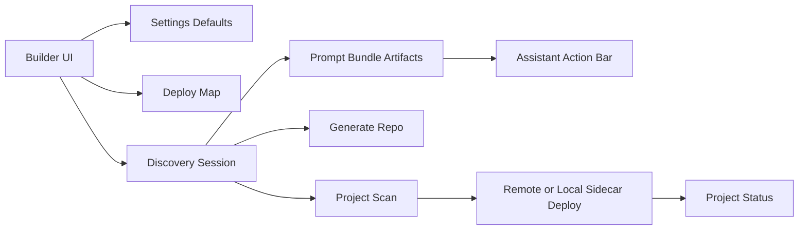
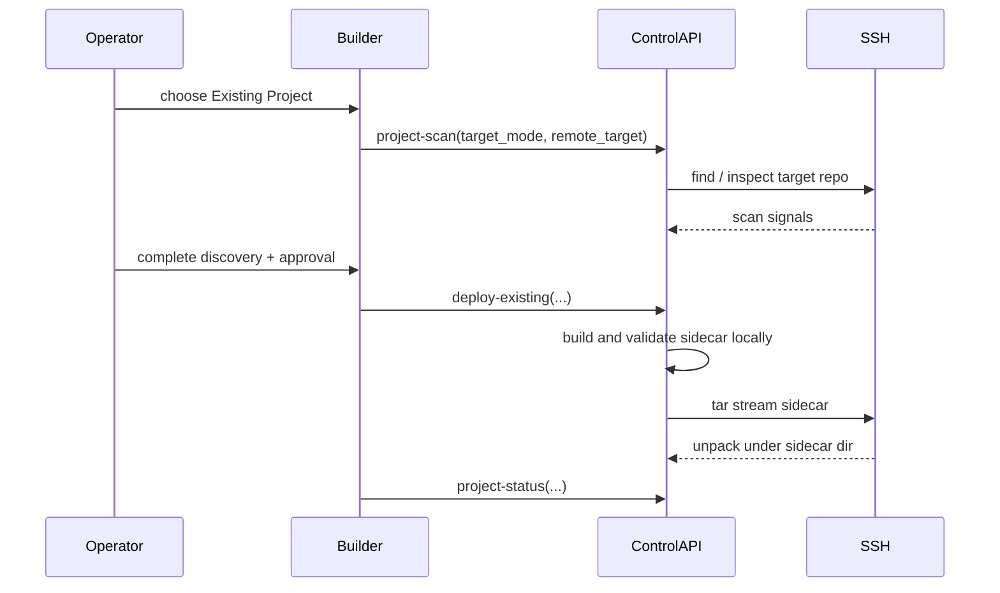

# Project Builder Visual Reference

## Block Diagram

## Existing Project Sequence

## Template Fill Map

The UI now uses two visual layers:

- React Flow in `/deploy-map` and `/builder` for workflow graphs.
- Expandable tree views for baseline template paths and concrete generated output.

The fill tree groups generated files into four source buckets:

- `seed_template`
- `profile_overlay`
- `user_filled`
- `scan_derived`

Use this visual to explain what was prefilled by the base harness and what changed because of discovery or scan context.
